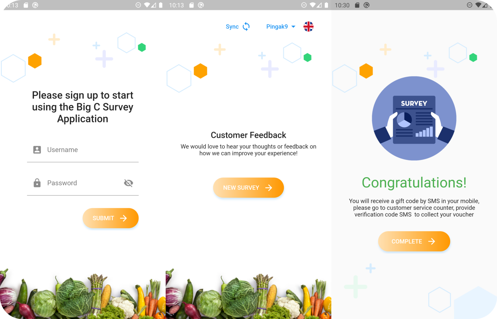
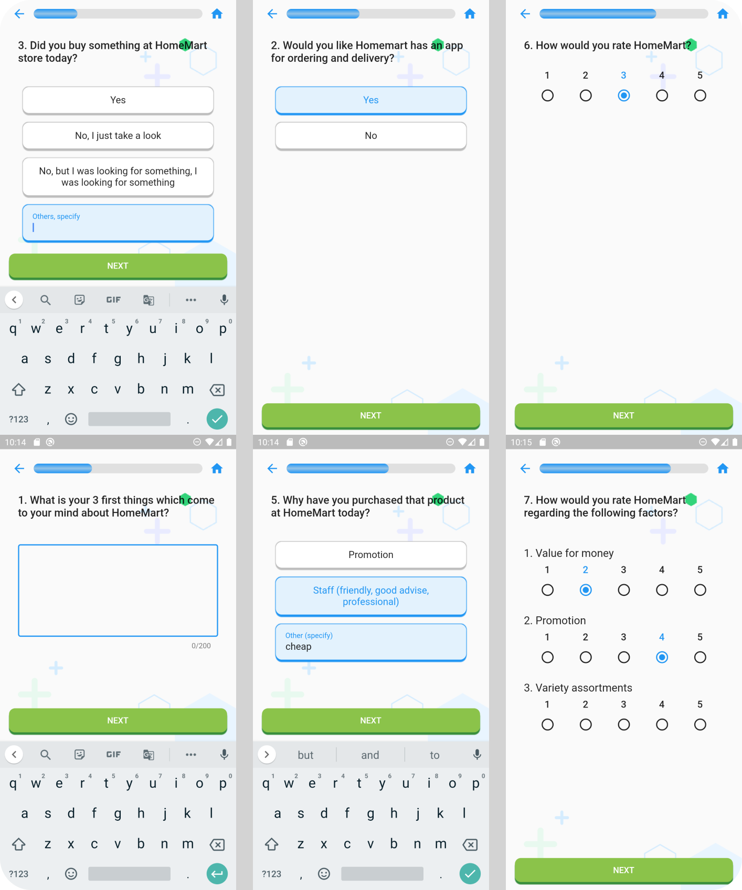
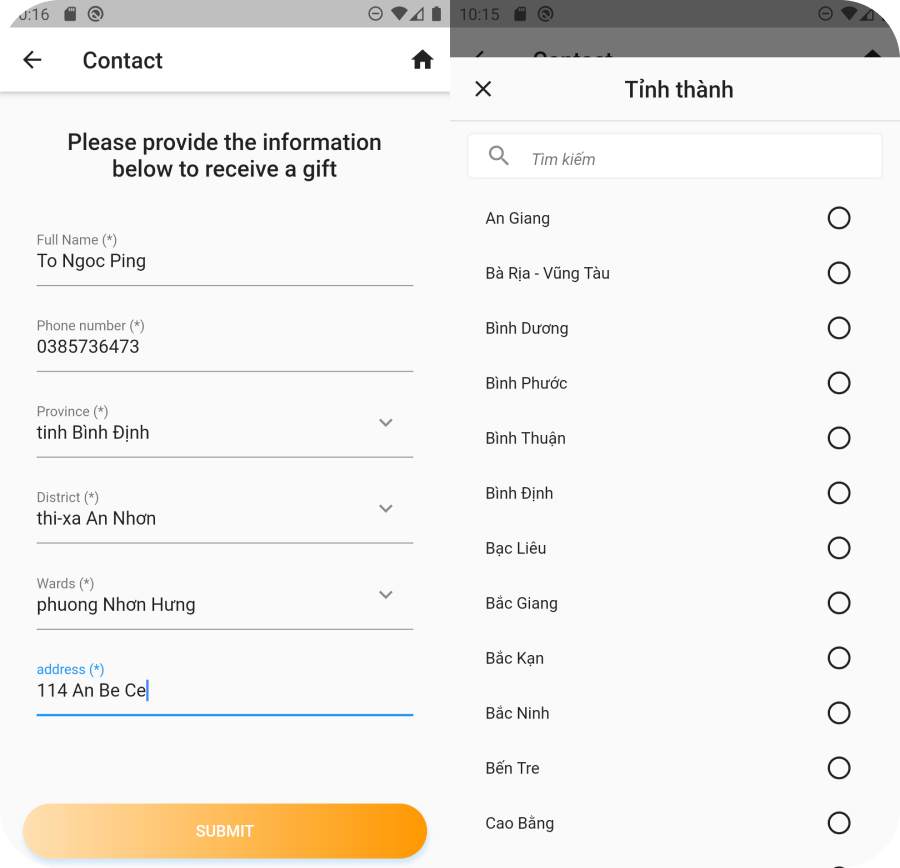

# Init Survey Flutter App

A Flutter mobile survey application with bilingual support (English / Vietnamese), offline storage, and sync. Survey questions are loaded from bundled JSON and answers can be submitted with contact details.

**Demo form (reference):** [Google Form](https://forms.gle/yDqRS22fkzAYp36j7)

## Features

- **Survey flow** — Page-based questions with progress indicator, back navigation, and validation
- **Bilingual UI** — English and Vietnamese (questions and app strings)
- **Offline-first** — Questions bundled in `assets/datas/data.json`; completed surveys saved locally
- **Sync** — Upload pending survey results when connectivity is available
- **Authentication** — Login with persisted user session and token
- **Contact form** — Collect respondent details with Vietnam administrative divisions (province / district / ward)
- **Address search** — Search and select addresses during contact entry

## Supported question types

| Type | Description |
|------|-------------|
| Short answer | Free-text response |
| Single choice | One option (radio) |
| Multiple choice | Multiple options (checkbox), including "Other, specify" |
| Linear scale | Single rating on a numeric scale |
| Linear scale grid | Rating grid with rows and columns |

## Getting started

### Prerequisites

- [Flutter SDK](https://docs.flutter.dev/get-started/install) (Dart `>=3.3.1 <4.0.0`)
- Xcode (iOS) and/or Android Studio (Android)

### Install and run

```bash
git clone <repository-url>
cd init-survey-flutter-app
flutter pub get
flutter run
```

### Run tests

```bash
flutter test
```

## Project structure

```
lib/
├── core/              # Router, config, storage, constants
├── locale/            # i18n delegates and language switching
├── model/             # Survey, answer, and user models
├── repository/        # API, login, question loading, sync
├── view/              # Screens (login, home, survey, contact, result)
├── ui/                # Reusable widgets, buttons, forms
├── administrations/   # Vietnam province / district / ward data
└── search_address/    # Address search UI and provider
assets/
├── datas/data.json    # Survey question definitions
├── locale/            # Translation JSON (en, vi)
└── administrations/   # Administrative division JSON files
```

## Configuration

Survey questions are loaded from the local asset file by default:

```dart
// lib/repository/question_repository.dart
assets/datas/data.json
```

Remote API endpoints are stubbed for future integration in `lib/core/constans.dart` and the repository layer (`QuestionRepository`, `SurveyRepository`).

## Tech stack

- **Flutter** — UI framework
- **Provider** — State management
- **shared_preferences** — Local persistence
- **http** — Network requests
- **connectivity** — Online/offline detection
- **webview_flutter** — Embedded web content

## Screenshots






